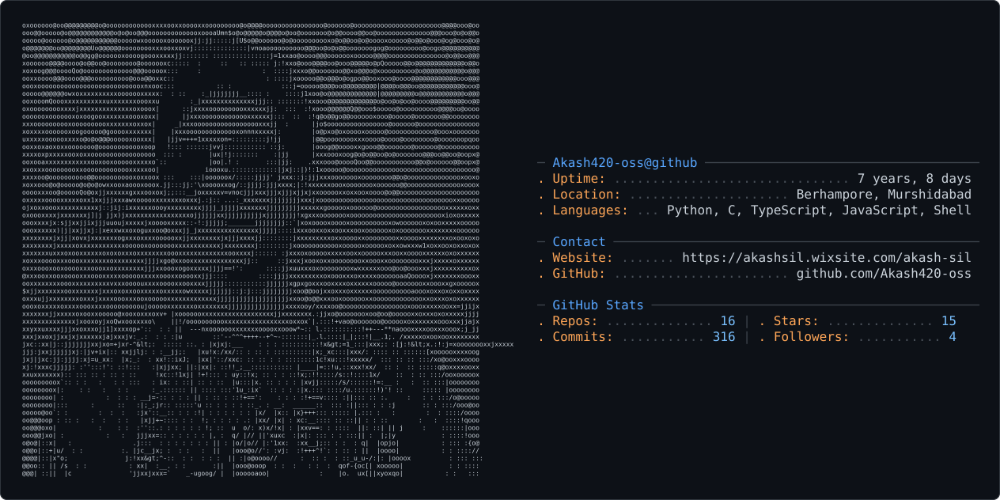

<!-- ╔══════════════════════════════════════════════════════════╗ -->
<!-- ║          Akash420-oss — GitHub Profile README            ║ -->
<!-- ╚══════════════════════════════════════════════════════════╝ -->

<!-- ━━━━━━━━━━━━━━━━━━  ASCII PROFILE CARD  ━━━━━━━━━━━━━━━━━━ -->

  <picture>
    <source media="(prefers-color-scheme: dark)"  srcset="dark_mode.svg" />
    <source media="(prefers-color-scheme: light)" srcset="light_mode.svg" />
    
  </picture>

---

<!-- ━━━━━━━━━━━━━━━━━━━━  HERO BANNER  ━━━━━━━━━━━━━━━━━━━━━━━ -->

  

<!-- ━━━━━━━━━━━━━━━━━━  ANIMATED TITLE  ━━━━━━━━━━━━━━━━━━━━━━ -->
<h1 align="center">
  
</h1>

<h2 align="center">
  
  &nbsp;...𓆩Ⱥҟⱥꞩħ Ꞩīł𓆪...&nbsp;
  
</h2>

<!-- Animated wave separator -->
<h3 align="center">
  
</h3>

<!-- Profile view counter -->

  

---

<!-- ━━━━━━━━━━━━━━━━━━━━  WHO AM I  ━━━━━━━━━━━━━━━━━━━━━━━━━━ -->
<table align="center" width="100%">
<tr>
<td width="60%" valign="top">

### 🕵️ Who Am I...

- 😉 I may be mistaken for a robot, but trust me, I'm just a human with an exceptionally well-oiled brain…
- 🛡️ Skilled in **C**, **Python**, and **Shell scripting** for security assessments & tool development
- 💻 Experienced in **Linux** environments — system administration, command-line wizardry
- 🌐 Specialised in **IoT Security** — protocols, device architectures & vulnerabilities
- 🔥 Passionate about **Network Penetration Testing** and **Reverse Engineering**
- 💡 Open to collaborate on **cybersecurity**, **pen-testing** & **RE** projects
- 🧠 Constantly learning — staying sharp on the latest in ethical hacking & exploit dev

 

🔴 **H0w T0 R34ch M3 ➢** `akashsil420@duck.com`

</td>
<td width="40%" align="center" valign="middle">
  
</td>
</tr>
</table>

---

<!-- ━━━━━━━━━━━━━━━━━━  SOCIAL BADGES  ━━━━━━━━━━━━━━━━━━━━━━━ -->
<h3 align="center">🌐 Connect with Me</h3>

  <!-- LinkedIn -->
  &nbsp;
  <!-- Instagram -->
  &nbsp;
  <!-- Facebook -->
  &nbsp;
  <!-- Email -->
  

<!-- GIF social icons (original personality icons beneath badges) -->

  
  
  

---

<!-- ━━━━━━━━━━━━━━━  LOVE INJECTION LINE  ━━━━━━━━━━━━━━━━━━━━━ -->

  🟢 <b>┣▇▇ 𝙻𝚘𝚟𝚎 𝙸𝚗𝚓𝚎𝚌𝚝𝚒𝚘𝚗 ▇▇═─ ❤️</b>
  &nbsp;
  

---

<!-- ━━━━━━━━━━━━━━━━━  TOOLS & EXPLOITS  ━━━━━━━━━━━━━━━━━━━━━━ -->
<h3 align="center">
  
  &nbsp;Exploits &amp; Utilities
</h3>

  &nbsp;
  &nbsp;
  &nbsp;
  &nbsp;
  &nbsp;
  &nbsp;
  &nbsp;
  &nbsp;
  &nbsp;
  &nbsp;
  &nbsp;
  

---

<!-- ━━━━━━━━━━━━━━━━━━  GITHUB STATS  ━━━━━━━━━━━━━━━━━━━━━━━━ -->
<h3 align="center">📊 GitHub Stats</h3>

  <picture>
    <source media="(prefers-color-scheme: dark)"
      srcset="https://github-readme-stats.vercel.app/api?username=akash420-oss&show_icons=true&theme=gotham&hide_border=true&include_all_commits=true&count_private=true&bg_color=0d1117" />
    <source media="(prefers-color-scheme: light)"
      srcset="https://github-readme-stats.vercel.app/api?username=akash420-oss&show_icons=true&theme=default&hide_border=true&include_all_commits=true&count_private=true" />
    
  </picture>
  &nbsp;
  <picture>
    <source media="(prefers-color-scheme: dark)"
      srcset="https://github-readme-stats.vercel.app/api/top-langs?username=akash420-oss&layout=compact&theme=gotham&hide_border=true&bg_color=0d1117&langs_count=8" />
    <source media="(prefers-color-scheme: light)"
      srcset="https://github-readme-stats.vercel.app/api/top-langs?username=akash420-oss&layout=compact&theme=default&hide_border=true&langs_count=8" />
    
  </picture>

<!-- Streak stats -->

   
  <picture>
    <source media="(prefers-color-scheme: dark)"
      srcset="https://streak-stats.demolab.com?user=akash420-oss&theme=gotham&hide_border=true&background=0d1117" />
    <source media="(prefers-color-scheme: light)"
      srcset="https://streak-stats.demolab.com?user=akash420-oss&theme=default&hide_border=true" />
    
  </picture>

---

<!-- ━━━━━━━━━━━━━━━━━━━  PROJECTS  ━━━━━━━━━━━━━━━━━━━━━━━━━━━ -->
<h3 align="center">🚀 Projects</h3>

  

 

| 🛠️ Project | 📝 Description | ⭐ |
|:---|:---|:---:|
| [**NetRecon**](https://github.com/Akash420-oss) | Network recon & port scanning toolkit built in Python + Scapy | 🔥 |
| [**GhidraPlugins**](https://github.com/Akash420-oss) | Custom Ghidra scripts for automated reverse engineering | 🔥 |
| [**IoT-Pwner**](https://github.com/Akash420-oss) | IoT device vulnerability scanner & exploit framework | 🔥 |
| [**ShellSorcery**](https://github.com/Akash420-oss) | Advanced bash scripts for Linux post-exploitation | 🔥 |

---

<!-- ━━━━━━━━━━━━━━━  CONTRIBUTION SNAKE  ━━━━━━━━━━━━━━━━━━━━━━ -->
<h3 align="center">🐍 Contribution Snake</h3>

  <picture>
    <source media="(prefers-color-scheme: dark)"
      srcset="https://raw.githubusercontent.com/Akash420-oss/Akash420-oss/output/github-snake-dark.svg" />
    <source media="(prefers-color-scheme: light)"
      srcset="https://raw.githubusercontent.com/Akash420-oss/Akash420-oss/output/github-snake.svg" />
    
  </picture>

---

<!-- ━━━━━━━━━━━━━━━━━  ACTIVITY GRAPH  ━━━━━━━━━━━━━━━━━━━━━━━━ -->

  <picture>
    <source media="(prefers-color-scheme: dark)"
      srcset="https://github-readme-activity-graph.vercel.app/graph?username=akash420-oss&theme=github-dark&hide_border=true&area=true" />
    <source media="(prefers-color-scheme: light)"
      srcset="https://github-readme-activity-graph.vercel.app/graph?username=akash420-oss&theme=github-light&hide_border=true&area=true" />
    
  </picture>

---

<!-- ━━━━━━━━━━━━━━━━━━  FOOTER  ━━━━━━━━━━━━━━━━━━━━━━━━━━━━━━ -->

  

  <i>"The quieter you become, the more you are able to hear."</i>
   
  — Kali Linux 🐉

