  

<h1 align="center">Akash Sil</h1>

  

  
  
  
  

## About

- Skilled in **C**, **Python** and **shell scripting** for security assessments and tool development.
- At home in **Linux** — system administration and command-line work.
- Specialised in **IoT security**: protocols, device architectures, and the vulnerabilities that live between them.
- Focused on **network penetration testing** and **reverse engineering**.
- Open to collaborate on cybersecurity, pen-testing and RE projects.
- Constantly learning — staying sharp on ethical hacking and exploit development.
- I may be mistaken for a robot. I'm just a human with a well-oiled brain.

**Reach me** → [`akashsil420@duck.com`](mailto:akashsil420@duck.com)

## Toolchain

  
  
  
  
  
  
  

  
  
  
  
  
  
  
  

  
  
  
  
  
  

## GitHub

  
  

  

  

  <code>reverse engineering — reading someone else's mind, one instruction at a time</code>

